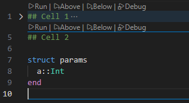

# JuliaFoldableCells

Enable folding cells in Julia files based on markdown comments.

## Features

## Known Issues

This extension overrides the default folding of VSCode. Hence, it has been needed to re-implement the structural folding of the Julia language.

## Release Notes

Users appreciate release notes as you update your extension.

### 1.0.0

Initial release.
